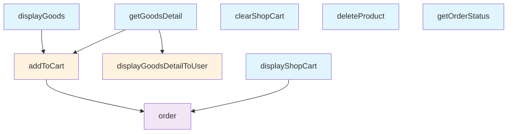

# 工具依赖关系架构

## 概述

ToolHub 实现了基于工具执行状态的动态工具可用性系统，通过工具间的拓扑关系来控制哪些工具对 agent 可见。系统采用有向无环图（DAG）结构管理工具依赖关系，支持实时更新工具可用性状态。

## 核心概念

### 1. 工具依赖类型

```typescript
export interface ToolDependency {
  toolName: string;           // 依赖的工具名称
  type: 'required' | 'optional' | 'alternative';  // 依赖类型
  condition?: (context: ToolExecutionContext) => boolean;  // 依赖条件
  description?: string;       // 依赖描述
}
```

- **required**: 必须依赖，工具必须执行过才能使用
- **optional**: 可选依赖，工具执行过会更好，但不是必需的
- **alternative**: 替代依赖，多个工具中至少一个执行过即可

### 2. 工具节点

```typescript
export interface ToolNode {
  name: string;                    // 工具名称
  config: ToolConfig;              // 工具配置
  dependencies: ToolDependency[];  // 依赖的工具列表
  dependents: string[];            // 依赖此工具的其他工具
  available: boolean;              // 是否可用
  availabilityReason?: string;     // 可用性原因
  lastExecuted?: Date;             // 最后执行时间
  executionCount: number;          // 执行次数
}
```

## 西城咖啡工具依赖关系

### 依赖关系图



### 工具分组

#### 根工具（无依赖）
- `displayGoods` - 展示商品列表
- `getGoodsDetail` - 获取商品详情
- `displayShopCart` - 展示购物车
- `clearShopCart` - 清空购物车
- `deleteProduct` - 删除商品
- `getOrderStatus` - 获取订单状态

#### 中间工具（有依赖）
- `addToCart` - 依赖 `displayGoods` 或 `getGoodsDetail`
- `displayGoodsDetailToUser` - 依赖 `getGoodsDetail`

#### 叶子工具（最终操作）
- `order` - 依赖 `addToCart` 或 `displayShopCart`

### 执行流程

#### 1. 商品浏览流程
```
displayGoods → getGoodsDetail → displayGoodsDetailToUser
```

#### 2. 购买流程
```
displayGoods → getGoodsDetail → addToCart → displayShopCart → order
```

#### 3. 快速购买流程
```
displayGoods → addToCart → order
```

## 系统架构

### 1. 核心组件

```typescript
export class ToolDependencyManager {
  private graph: ToolDependencyGraph;           // 依赖图
  private executionHistory: Map<string, ToolExecutionContext[]>;  // 执行历史
  private logger: Logger;                       // 日志器
}
```

### 2. 依赖图结构

```typescript
export interface ToolDependencyGraph {
  nodes: Map<string, ToolNode>;        // 所有工具节点
  edges: Map<string, Set<string>>;     // 依赖关系边
  rootNodes: Set<string>;              // 根节点（无依赖）
  leafNodes: Set<string>;              // 叶子节点（无被依赖）
}
```

### 3. 可用性检查

```typescript
export interface ToolAvailabilityStatus {
  toolName: string;                    // 工具名称
  available: boolean;                  // 是否可用
  reason: string;                      // 可用性原因
  missingDependencies: string[];       // 缺失的依赖
  suggestedActions: string[];          // 建议的下一步操作
}
```

## 事件驱动更新

### 1. 工具执行事件

当工具执行成功时，系统会：

1. 记录工具执行到依赖管理器
2. 更新工具执行统计
3. 检查依赖此工具的其他工具可用性
4. 发送工具可用性变化事件

```typescript
// 记录工具执行
this.dependencyManager.recordToolExecution(toolName, context);

// 更新依赖此工具的其他工具
this.updateDependentToolsAvailability(toolName);
```

### 2. 实时可用性更新

```typescript
// 检查工具可用性
const availability = this.dependencyManager.checkToolAvailability(toolName);

// 更新工具节点状态
node.available = availability.available;
node.availabilityReason = availability.reason;
```

## 使用示例

### 1. 基础使用

```typescript
import { ToolHub } from './tool-hub';
import { WestoreCafeTools } from './westore-cafe-tools';
import { WestoreCafeDependencies } from './westore-cafe-dependencies';

// 创建 ToolHub
const toolHub = new ToolHub();

// 注册工具及其依赖关系
const tools = WestoreCafeTools.getAll();
const dependencies = WestoreCafeDependencies.getDependencies();

tools.forEach(tool => {
  const toolDependencies = dependencies.get(tool.name) || [];
  toolHub.register(tool, toolDependencies);
});

// 获取当前可用的工具
const availableTools = toolHub.getAvailableTools();
console.log('可用工具:', availableTools.map(t => t.name));
```

### 2. 动态工具执行

```typescript
// 执行工具
const context = {
  executionId: 'exec_001',
  sessionId: 'session_001',
  threadId: 'thread_001'
};

// 执行 displayGoods
await toolHub.execute('displayGoods', { goodsList: [...] }, {}, context);

// 现在 addToCart 变为可用
const addToCartAvailable = toolHub.getToolAvailabilityStatus('addToCart');
console.log('addToCart 可用:', addToCartAvailable.available);

// 执行 addToCart
await toolHub.execute('addToCart', { items: [...] }, {}, context);

// 现在 order 变为可用
const orderAvailable = toolHub.getToolAvailabilityStatus('order');
console.log('order 可用:', orderAvailable.available);
```

### 3. 导出可用工具执行器

```typescript
// 导出基于依赖关系的可用工具执行器
const executor = toolHub.exportAvailableToolExecutor('langchain');

// 在 LangGraph 中使用
const workflow = new StateGraph(MessagesAnnotation)
  .addNode("tools", executor)  // 只包含当前可用的工具
  .addEdge(START, "tools");
```

## 高级功能

### 1. 执行路径建议

```typescript
// 获取到达目标工具的路径
const path = toolHub.getExecutionPathSuggestion('order');
console.log('执行路径:', path); // ['displayGoods', 'addToCart', 'order']
```

### 2. 工具统计信息

```typescript
const stats = toolHub.getToolStatistics();
console.log('工具统计:', {
  totalTools: stats.totalTools,
  availableTools: stats.availableTools,
  executedTools: stats.executedTools,
  averageExecutionCount: stats.averageExecutionCount
});
```

### 3. 依赖图可视化

```typescript
const graph = toolHub.getDependencyGraph();
console.log('根节点:', Array.from(graph.rootNodes));
console.log('叶子节点:', Array.from(graph.leafNodes));
console.log('依赖关系:', Object.fromEntries(graph.edges));
```

### 4. 重置功能

```typescript
// 重置特定工具的执行状态
toolHub.resetToolExecution('addToCart');

// 重置所有工具的执行状态
toolHub.resetAllToolExecution();
```

## 最佳实践

### 1. 依赖关系设计

- 保持依赖关系简单清晰
- 避免循环依赖
- 使用 alternative 类型处理多种路径
- 为复杂条件提供 condition 函数

### 2. 工具分组

- 将相关工具分组管理
- 为不同场景设计不同的执行流程
- 提供工具优先级排序

### 3. 事件监听

- 监听工具可用性变化事件
- 实现工具执行状态监控
- 提供用户友好的状态反馈

### 4. 性能优化

- 缓存工具可用性状态
- 批量更新依赖工具状态
- 避免频繁的可用性检查

## 扩展性

### 1. 自定义依赖条件

```typescript
const customDependency: ToolDependency = {
  toolName: 'getUserInfo',
  type: 'required',
  condition: (context) => {
    // 自定义条件：用户必须已登录
    return context.metadata?.userLoggedIn === true;
  },
  description: '需要用户登录状态'
};
```

### 2. 动态依赖关系

```typescript
// 运行时动态添加依赖关系
toolHub.addToolDependency('order', {
  toolName: 'paymentMethod',
  type: 'required',
  description: '需要选择支付方式'
});
```

### 3. 条件分支

```typescript
// 基于执行结果的动态依赖
const conditionalDependency: ToolDependency = {
  toolName: 'checkInventory',
  type: 'required',
  condition: (context) => {
    // 只有商品有库存时才需要检查
    return context.metadata?.hasInventory === true;
  }
};
```

## 总结

工具依赖关系系统为 ToolHub 提供了强大的动态工具管理能力，通过有向无环图结构管理工具间的依赖关系，实现了基于执行状态的实时工具可用性控制。系统支持多种依赖类型、条件检查、执行路径建议等高级功能，为复杂的工具编排场景提供了完整的解决方案。
